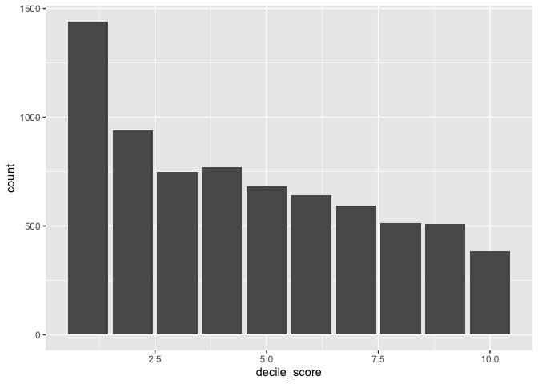
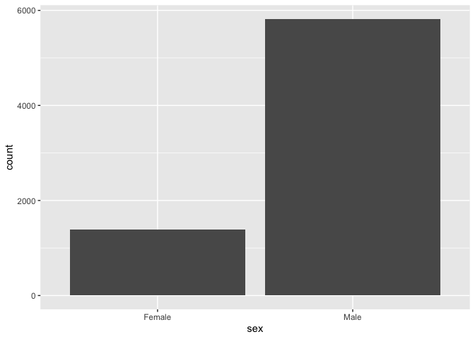
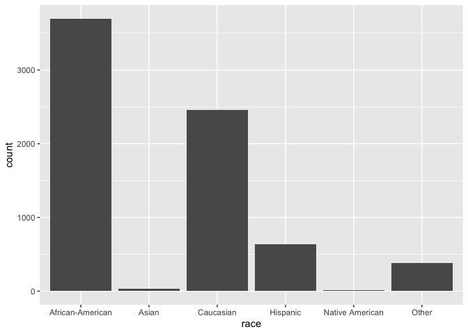
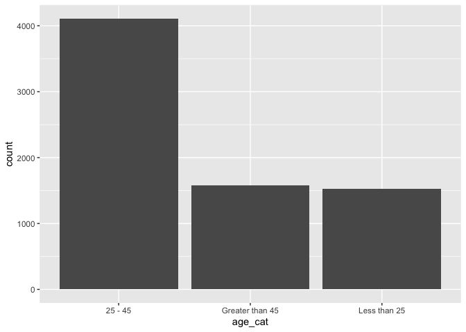
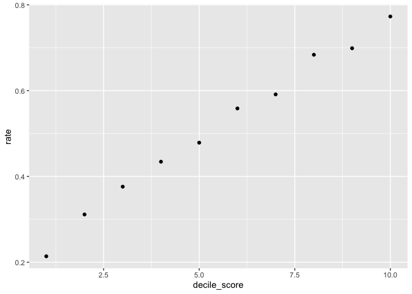

Lab 09: Algorithmic Bias
================
Haley Lam
3/15/26

## Load Packages and Data

First, let’s load the necessary packages:

``` r
library(tidyverse)
library(fairness)
```

    ## Warning: package 'fairness' was built under R version 4.5.2

``` r
library(janitor)
```

### The data

For this lab, we’ll use the COMPAS dataset compiled by ProPublica. The
data has been preprocessed and cleaned for you. You’ll have to load it
yourself. The dataset is available in the `data` folder, but I’ve
changed the file name from `compas-scores-two-years.csv` to
`compas-scores-2-years.csv`. I’ve done this help you practice debugging
code when you encounter an error.

Clean the code (given in the textbook online)

``` r
# Load the COMPAS data
compas <- read_csv("data/compas-scores-2-years.csv") %>%
  clean_names() %>%
  rename(
    decile_score = decile_score_12,
    priors_count = priors_count_15
  )
```

    ## New names:
    ## Rows: 7214 Columns: 53
    ## ── Column specification
    ## ──────────────────────────────────────────────────────── Delimiter: "," chr
    ## (19): name, first, last, sex, age_cat, race, c_case_number, c_charge_de... dbl
    ## (19): id, age, juv_fel_count, decile_score...12, juv_misd_count, juv_ot... lgl
    ## (1): violent_recid dttm (2): c_jail_in, c_jail_out date (12):
    ## compas_screening_date, dob, c_offense_date, c_arrest_date, r_offe...
    ## ℹ Use `spec()` to retrieve the full column specification for this data. ℹ
    ## Specify the column types or set `show_col_types = FALSE` to quiet this message.
    ## • `decile_score` -> `decile_score...12`
    ## • `priors_count` -> `priors_count...15`
    ## • `decile_score` -> `decile_score...40`
    ## • `priors_count` -> `priors_count...49`

``` r
# Take a look at the data
glimpse(compas)
```

    ## Rows: 7,214
    ## Columns: 53
    ## $ id                      <dbl> 1, 3, 4, 5, 6, 7, 8, 9, 10, 13, 14, 15, 16, 18…
    ## $ name                    <chr> "miguel hernandez", "kevon dixon", "ed philo",…
    ## $ first                   <chr> "miguel", "kevon", "ed", "marcu", "bouthy", "m…
    ## $ last                    <chr> "hernandez", "dixon", "philo", "brown", "pierr…
    ## $ compas_screening_date   <date> 2013-08-14, 2013-01-27, 2013-04-14, 2013-01-1…
    ## $ sex                     <chr> "Male", "Male", "Male", "Male", "Male", "Male"…
    ## $ dob                     <date> 1947-04-18, 1982-01-22, 1991-05-14, 1993-01-2…
    ## $ age                     <dbl> 69, 34, 24, 23, 43, 44, 41, 43, 39, 21, 27, 23…
    ## $ age_cat                 <chr> "Greater than 45", "25 - 45", "Less than 25", …
    ## $ race                    <chr> "Other", "African-American", "African-American…
    ## $ juv_fel_count           <dbl> 0, 0, 0, 0, 0, 0, 0, 0, 0, 0, 0, 0, 0, 0, 0, 0…
    ## $ decile_score            <dbl> 1, 3, 4, 8, 1, 1, 6, 4, 1, 3, 4, 6, 1, 4, 1, 3…
    ## $ juv_misd_count          <dbl> 0, 0, 0, 1, 0, 0, 0, 0, 0, 0, 0, 0, 0, 0, 0, 0…
    ## $ juv_other_count         <dbl> 0, 0, 1, 0, 0, 0, 0, 0, 0, 0, 0, 0, 0, 0, 0, 0…
    ## $ priors_count            <dbl> 0, 0, 4, 1, 2, 0, 14, 3, 0, 1, 0, 3, 0, 0, 1, …
    ## $ days_b_screening_arrest <dbl> -1, -1, -1, NA, NA, 0, -1, -1, -1, 428, -1, 0,…
    ## $ c_jail_in               <dttm> 2013-08-13 06:03:42, 2013-01-26 03:45:27, 201…
    ## $ c_jail_out              <dttm> 2013-08-14 05:41:20, 2013-02-05 05:36:53, 201…
    ## $ c_case_number           <chr> "13011352CF10A", "13001275CF10A", "13005330CF1…
    ## $ c_offense_date          <date> 2013-08-13, 2013-01-26, 2013-04-13, 2013-01-1…
    ## $ c_arrest_date           <date> NA, NA, NA, NA, 2013-01-09, NA, NA, 2013-08-2…
    ## $ c_days_from_compas      <dbl> 1, 1, 1, 1, 76, 0, 1, 1, 1, 308, 1, 0, 0, 1, 4…
    ## $ c_charge_degree         <chr> "F", "F", "F", "F", "F", "M", "F", "F", "M", "…
    ## $ c_charge_desc           <chr> "Aggravated Assault w/Firearm", "Felony Batter…
    ## $ is_recid                <dbl> 0, 1, 1, 0, 0, 0, 1, 0, 0, 1, 0, 1, 0, 0, 1, 1…
    ## $ r_case_number           <chr> NA, "13009779CF10A", "13011511MM10A", NA, NA, …
    ## $ r_charge_degree         <chr> NA, "(F3)", "(M1)", NA, NA, NA, "(F2)", NA, NA…
    ## $ r_days_from_arrest      <dbl> NA, NA, 0, NA, NA, NA, 0, NA, NA, 0, NA, NA, N…
    ## $ r_offense_date          <date> NA, 2013-07-05, 2013-06-16, NA, NA, NA, 2014-…
    ## $ r_charge_desc           <chr> NA, "Felony Battery (Dom Strang)", "Driving Un…
    ## $ r_jail_in               <date> NA, NA, 2013-06-16, NA, NA, NA, 2014-03-31, N…
    ## $ r_jail_out              <date> NA, NA, 2013-06-16, NA, NA, NA, 2014-04-18, N…
    ## $ violent_recid           <lgl> NA, NA, NA, NA, NA, NA, NA, NA, NA, NA, NA, NA…
    ## $ is_violent_recid        <dbl> 0, 1, 0, 0, 0, 0, 0, 0, 0, 1, 0, 0, 0, 0, 0, 0…
    ## $ vr_case_number          <chr> NA, "13009779CF10A", NA, NA, NA, NA, NA, NA, N…
    ## $ vr_charge_degree        <chr> NA, "(F3)", NA, NA, NA, NA, NA, NA, NA, "(F2)"…
    ## $ vr_offense_date         <date> NA, 2013-07-05, NA, NA, NA, NA, NA, NA, NA, 2…
    ## $ vr_charge_desc          <chr> NA, "Felony Battery (Dom Strang)", NA, NA, NA,…
    ## $ type_of_assessment      <chr> "Risk of Recidivism", "Risk of Recidivism", "R…
    ## $ decile_score_40         <dbl> 1, 3, 4, 8, 1, 1, 6, 4, 1, 3, 4, 6, 1, 4, 1, 3…
    ## $ score_text              <chr> "Low", "Low", "Low", "High", "Low", "Low", "Me…
    ## $ screening_date          <date> 2013-08-14, 2013-01-27, 2013-04-14, 2013-01-1…
    ## $ v_type_of_assessment    <chr> "Risk of Violence", "Risk of Violence", "Risk …
    ## $ v_decile_score          <dbl> 1, 1, 3, 6, 1, 1, 2, 3, 1, 5, 4, 4, 1, 2, 1, 2…
    ## $ v_score_text            <chr> "Low", "Low", "Low", "Medium", "Low", "Low", "…
    ## $ v_screening_date        <date> 2013-08-14, 2013-01-27, 2013-04-14, 2013-01-1…
    ## $ in_custody              <date> 2014-07-07, 2013-01-26, 2013-06-16, NA, NA, 2…
    ## $ out_custody             <date> 2014-07-14, 2013-02-05, 2013-06-16, NA, NA, 2…
    ## $ priors_count_49         <dbl> 0, 0, 4, 1, 2, 0, 14, 3, 0, 1, 0, 3, 0, 0, 1, …
    ## $ start                   <dbl> 0, 9, 0, 0, 0, 1, 5, 0, 2, 0, 0, 4, 1, 0, 0, 0…
    ## $ end                     <dbl> 327, 159, 63, 1174, 1102, 853, 40, 265, 747, 4…
    ## $ event                   <dbl> 0, 1, 0, 0, 0, 0, 1, 0, 0, 1, 0, 1, 0, 0, 1, 1…
    ## $ two_year_recid          <dbl> 0, 1, 1, 0, 0, 0, 1, 0, 0, 1, 0, 1, 0, 0, 1, 1…

## Part 1: Exploring the Data

### Exercise \#1

Each row represents an individual, and the columns have variables about
that individual (e.g., sex, age, race) There are 7214 individuals and 53
pieces of information about each individual.

### Exercise \#2

``` r
# number of duplicates in the dataset (based on name)
sum(duplicated(compas$name))
```

    ## [1] 56

There are 56 duplicates! They might be defendants who were arrested
multiple times?

### Exercise \#3

Let’s examine the distribution of decile_score

``` r
ggplot(compas, aes(x = decile_score)) +
  geom_bar()
```

<!-- --> It is not
normally distributed and right-skewed! Most people are given a low
decile_score.

### Exercise \#4

Distribution of demographics in the dataset.

``` r
# Sex
ggplot(compas, aes(x = sex))+
  geom_bar()
```

<!-- -->

``` r
# Race
ggplot(compas, aes(x = race))+
  geom_bar()
```

<!-- -->

``` r
# Age
ggplot(compas, aes(x = age_cat))+
  geom_bar()
```

<!-- -->

## Part 2: Risk Scores and Recidivism

### Exercise \#5

What’s the relationship between risk scores and recidivism?

``` r
compas %>%
  group_by(decile_score) %>%
  summarize(rate = mean(two_year_recid, na.rm = TRUE)) %>%
  ggplot(aes(x = decile_score, y = rate)) +
  geom_point()
```

<!-- --> Wow! That is
a very positively correlated scatterplot if I’ve seen one!

### Exercise \#6

The “accuracy” of the algorithm

``` r
compas <- compas %>%
  mutate(compas_classification = case_when(
    decile_score >= 7 & two_year_recid == 1 ~ "TP",
    decile_score <= 4 & two_year_recid == 0 ~ "TN",
    decile_score >= 7 & two_year_recid == 0 ~ "FP",
    decile_score <= 4 & two_year_recid == 1 ~ "FN",
    TRUE ~ NA_character_
  ))

compas %>% 
  count(compas_classification)
```

    ## # A tibble: 5 × 2
    ##   compas_classification     n
    ##   <chr>                 <int>
    ## 1 FN                     1216
    ## 2 FP                      644
    ## 3 TN                     2681
    ## 4 TP                     1351
    ## 5 <NA>                   1322

There are 1,216 false negatives and 644 false positives. There are 2,681
true negatives and 1,351 true positives.

### Exercise \#7

``` r
compas %>%
  filter(!is.na(compas_classification)) %>%
  summarize(
    accuracy = sum(compas_classification %in% c("TP", "TN")) / n()
  )
```

    ## # A tibble: 1 × 1
    ##   accuracy
    ##      <dbl>
    ## 1    0.684

Filtering out the NA values, the model got 68.4% correct. This isn’t
great!
